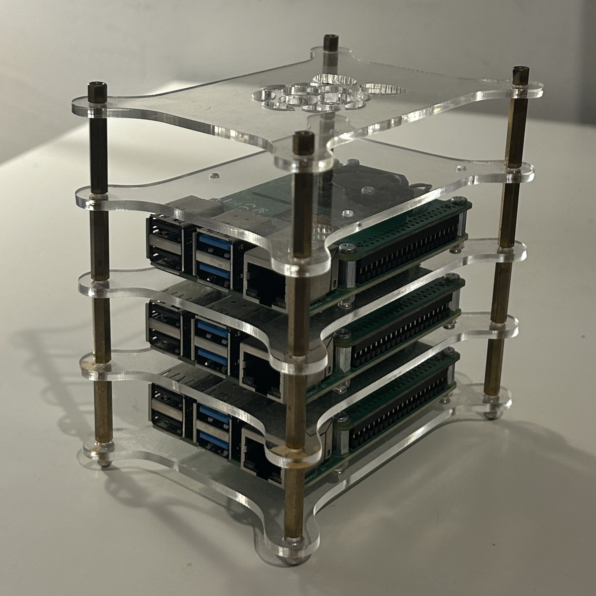
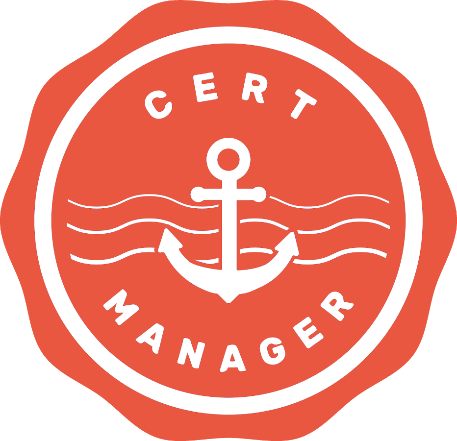
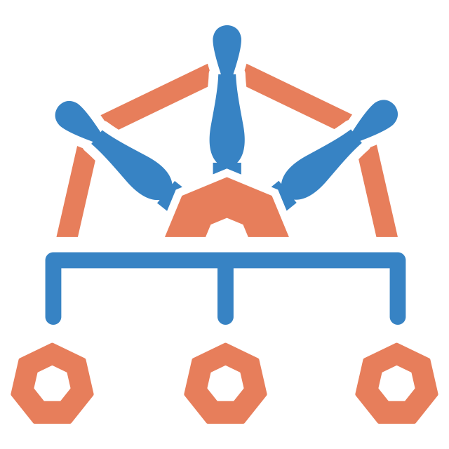
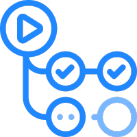

# Kubernetes Cluster using GitOps

A production-grade Kubernetes homelab running on three Raspberry Pi 4B nodes, managed fully via GitOps with Argo CD.

  

## Hardware

| Node | Hostname | IP | Role |
|------|----------|----|------|
| Raspberry Pi 4B (2GB) | k3s-master | 192.168.1.29 | Control Plane |
| Raspberry Pi 4B (2GB) | k3s-worker-01 | 192.168.1.31 | Worker |
| Raspberry Pi 4B (2GB) | k3s-worker-02 | 192.168.1.32 | Worker |

## Dashboards

| Service | URL | Deployed at |
|---------|-----|-------------|
| Argo CD | https://argocd.diogomota.com | Homelab Cluster |
| Grafana | https://grafana.diogomota.com | Virtual Machine |
| Prometheus | https://prometheus.diogomota.com | Virtual Machine |

Prometheus and Grafana run on a separate local cluster and scrape node-exporter from the Pi nodes over the local network.

All services are exposed via Cilium ingress with TLS certificates issued automatically by cert-manager (Let's Encrypt).

## Tech Stack

| Logo | Tool | Purpose | Status |
|------|------|---------|--------|
|  | k3s | Lightweight Kubernetes distribution | Active |
|  | Argo CD | GitOps continuous delivery | Active |
|  | Helm | Package manager | Active |
|  | Kustomize | Manifest customisation | Active |
|  | Cilium | CNI, network policies, ingress | Active |
|  | cert-manager | Automatic TLS via Let's Encrypt | Active |
|  | Kyverno | Policy enforcement | Inactive due to RAM usage |
|  | Node Exporter | Host-level metrics (scraped remotely) | Active |
|  | Prometheus | Metrics & alerting | Active (separate cluster) |
|  | Grafana | Dashboards & observability | Active (separate cluster) |
|  | GitHub Actions | CI - build & push images | Inactive |
|  | Renovate Bot | Automated dependency updates | Inactive |
|  | Golang | Custom scraper | Inactive |

## Installation

The file [installation.md](installation.md) has the detailed setup instructions covering OS preparation, k3s cluster bootstrap, Argo CD deployment and post-install verification.